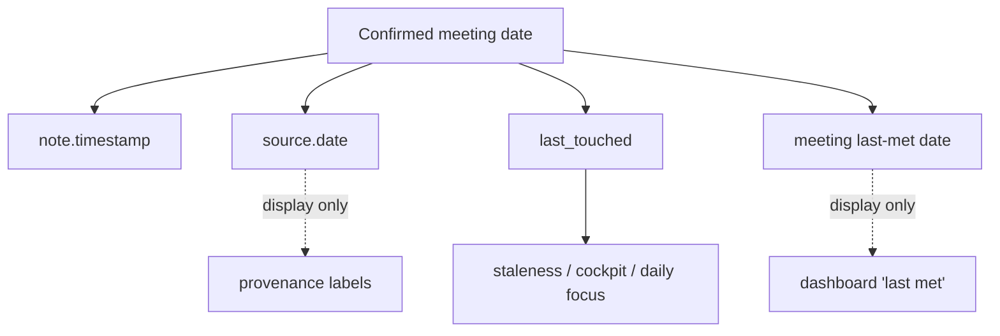

# Meeting-date backfill (event-time follow-through)

## Summary

Add a manual meeting-date control to the capture screen, defaulting to today, that records when a meeting actually happened. The confirmed date anchors the follow-through engine's staleness clock and item provenance to the meeting date instead of the paste-in time, so a backfilled meeting's commitments age from when they were really made. It reuses fields that already exist, so there is no schema bump and no migration.

---

## Problem Frame

The app assumes a note pasted today describes a meeting that happened today. Every commitment it extracts starts its staleness clock at ingestion time. When notes are entered a few days late (the normal case for a busy operator), the follow-through engine quietly mis-ages everything: a commitment made last Tuesday looks brand-new on Thursday and will not surface as slipping until a week after it actually should.

The failure is silent, and it is deeper than it looks. The staleness clock, the cockpit ranking, and the daily-focus "slipping" signal all read one field, `last_touched`, which is set to ingestion time at every write site. The provenance date (`source.date`) is display-only and feeds none of that logic. So the obvious fix, "let the user set the meeting date," changes only the labels unless the same date also seeds `last_touched`. A version that stores the date without re-anchoring the clock looks done and does nothing for follow-through, which is the product's reason to exist.

---

## Key Decisions

- KD1. Manual entry first. The user sets the date; AI inference of the date from note text is deferred. Manual is cheap, fully unit-testable in the dev harness, and avoids the save-ordering rework the AI path needs.
- KD2. Event-time semantics. The confirmed meeting date is the aging anchor, not just a label: it seeds `last_touched` for every commitment from that note. This is the load-bearing decision; without it the feature is cosmetic.
- KD3. Age honestly, no grace window. A backfilled commitment already past its window surfaces as slipping the moment it is accepted. The staleness rule stays pure and deterministic.
- KD4. The date is per-note. Each captured note carries its own meeting date, because a recurring meeting record cannot hold a single date. The newest note's date also updates the meeting's "last met" date for the dashboard, reviving a field that is currently always empty.
- KD5. Reuse existing fields. The chosen date is written into fields that already exist (`note.timestamp`, `source.date`, `last_touched`, `last_meeting_date`); only the value written changes, from "now" to "the chosen date." No new stored field means no `schema_version` bump and no import migration.
- KD6. Block future dates at entry. The date control will not accept a date after today, since a meeting cannot have happened in the future. This replaces the more elaborate "hold a future-dated item" guard considered during ideation.

The confirmed date fans out to several fields, but only one path drives behavior:

The `last_touched` path is the keystone (KD2). Seeding `source.date` and the last-met date without it changes only what the user reads, never how the engine behaves.

---

## Requirements

**Capturing the meeting date**

- R1. The capture screen presents a meeting-date control that defaults to today and can be changed before the note is saved. It uses buttons and change handlers, not a `<form>` element.
- R2. A note left at the default date behaves exactly as the app does today, with no added steps for same-day capture.
- R3. The control rejects any date after today.
- R4. The meeting date is a property of the captured note. Backfilling several past meetings means entering each note with its own date.

**Anchoring the follow-through engine (the keystone)**

- R5. The confirmed date becomes the provenance date of the note and of every item extracted from it, in place of the paste-in timestamp.
- R6. The confirmed date seeds the staleness clock (`last_touched`) of every commitment extracted from the note, so commitments age from the meeting date rather than ingestion time.
- R7. A backfilled commitment whose age already exceeds its staleness window surfaces as slipping immediately on acceptance, with no grace period.
- R8. Relative due dates written in the notes ("by Friday") resolve against the confirmed meeting date, so an inferred due date lands in the meeting's week, not the current one.

**Display and integrity**

- R9. The newest note's meeting date updates the meeting's "last met" date on the dashboard. Backfilling an older note never moves "last met" earlier than a more recent note already set it.
- R10. A date in a year other than the current year displays with its year, so backfilled prior-year dates are not ambiguous.

---

## Key Flows

- F1. Backfill a past meeting
  - **Trigger:** The user pastes notes from a meeting that happened earlier and wants them dated correctly.
  - **Steps:** Paste the note; change the meeting-date control from today to the past date; choose the destination meeting; save. Analysis runs with the chosen date as its anchor. On the verification screen the user accepts the extracted items.
  - **Outcome:** The note, its provenance, and every accepted commitment are dated to the meeting date; commitments age from that date and surface as slipping if already overdue; the dashboard "last met" reflects the date if it is the most recent.
  - **Covered by:** R1, R4, R5, R6, R7, R8, R9
- The same-day case is the default path: the user leaves the date at today and nothing about the current capture experience changes (R2).

---

## Acceptance Examples

- AE1. Same-day default unchanged
  - **Covers R2.** Given a note pasted today with the date control untouched, when it is saved and analyzed, then provenance and staleness behave exactly as in the current app.
- AE2. Backfilled overdue commitment surfaces immediately
  - **Covers R6, R7.** Given a weekly meeting (7-day window) backfilled to 10 days ago, when a commitment from it is accepted, then it shows as slipping right away because its age already exceeds the window.
- AE3. Future date refused
  - **Covers R3.** Given the date control, when the user attempts to set a date after today, then the control does not accept it.
- AE4. Relative due date resolves to the meeting's week
  - **Covers R8.** Given a note dated last Tuesday containing "send the deck by Thursday," when analysis runs, then the inferred due date is that Thursday, not a Thursday in the current week.
- AE5. Last-met never regresses
  - **Covers R9.** Given a meeting whose last note is dated this week, when the user backfills an older note from last month, then the dashboard "last met" date stays this week's.
- AE6. Prior-year date is unambiguous
  - **Covers R10.** Given a note dated in December of last year, when it is displayed in the current year, then the date shows its year.

---

## Scope Boundaries

**Deferred for later**

- AI inference of the meeting date from note text, including the post-accept rewrite it would require, an explicit-date parser, and storing a provenance flag that distinguishes inferred from user-entered dates.
- Cadence options (Daily and Outlook-style Custom weekday recurrence). A separate feature with its own brainstorm.

**Not in scope**

- Changes to the staleness math, escalation, or cockpit ranking themselves. This feature changes the date those mechanisms read, not how they compute.
- A grace window or any suppression of slipping-on-entry. Considered and rejected (KD3).
- A "held until" state for future-dated items. Replaced by blocking future entry (KD6).

---

## Dependencies / Assumptions

- The follow-through engine's staleness, cockpit, and daily-focus logic derive from `last_touched`; `source.date` is provenance-display only. Verified in `meeting-assistant.tsx`. This is what makes R6 the load-bearing requirement.
- The capture and verification screens and the save-before-analyze ordering already exist. Manual entry sets the date before save, so that ordering and its data-safety guarantee are preserved unchanged.
- `note.timestamp`, `source.date`, `last_touched`, and `last_meeting_date` already exist and can hold the chosen date; `last_meeting_date` is currently written only as null. No new stored field is introduced, so existing data, Import, and Export stay valid without migration.

---

## Outstanding Questions

**Deferred to planning**

- Where the date control sits on the capture surface and what the affordance looks like (inline control, the destination picker area, etc.).
- Whether capture aimed at a project update (rather than a meeting) also gets the date control, applying the same anchoring to project items. Leaning yes, since the same mis-aging applies; confirm during planning.
- Whether the "last met" update fires only at capture or also when a saved note's date is later edited.
- The exact behavior of the future-date block (disabled dates in the picker versus an inline message).

---

## Sources / Research

- Ideation: `docs/ideation/2026-06-20-cadence-and-meeting-date-ideation.html` (ideas 1 "Event-time staleness" and 2 "One meeting-date, two inputs").
- Code anchors in `meeting-assistant.tsx` for the planner: `last_touched` is read by `isUntouchedStale` and set to ingestion time at every write site (`proposalToItem`, the accept paths, status change, patch, manual add); `source.date` is stamped at note-save; `ctx.today` feeds the extraction due-date anchor; `last_meeting_date` is declared and set null but never otherwise written; `fmtDate` renders month and day with no year; `isOverdue` is gated on a confirmed due date.
- External grounding: event-time versus ingestion-time is a settled question (stream-processing watermarks; Obsidian Tasks anchors overdue to due-date, not created-date; Apple EventKit conflating the two is a documented anti-pattern).
