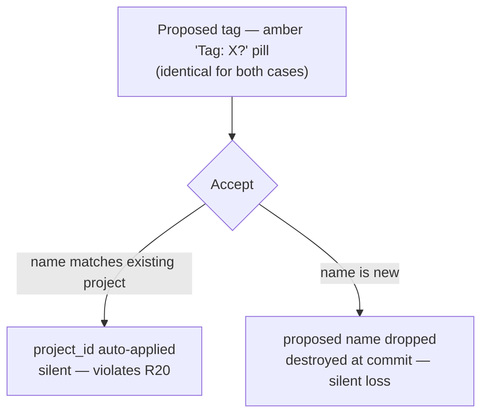
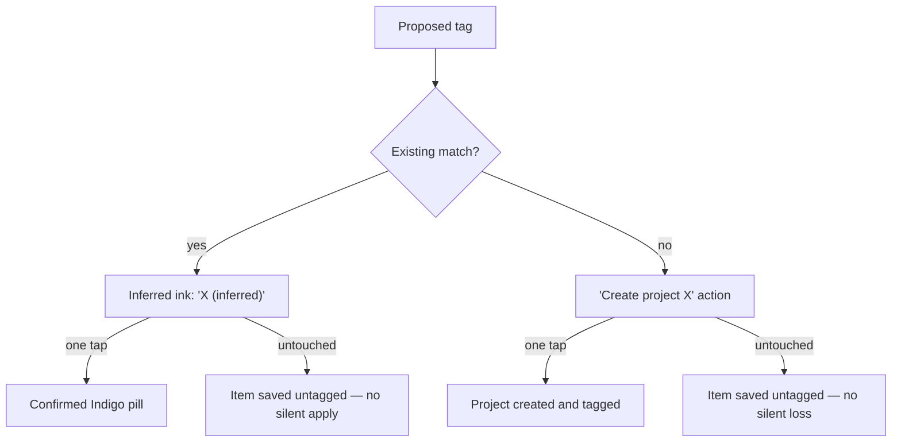

# Inferred project-tag confirmation model

## Summary

Change how an AI-proposed project tag behaves during note verification. No proposed tag is applied to an item unless the user confirms it, retiring today's amber "Tag: X?" pill that silently auto-applies existing matches and silently destroys new-project names. A proposed tag renders in the app's existing inferred visual language and confirms with a single tap; a genuinely new project name becomes an explicit "Create project X" action; and when the user opens the picker to retag, the recommendation surfaces at the top of the list without being pre-selected. It reuses the inferred-field pattern the app already ships for due dates and owners, so there is no schema bump and no migration.

---

## Problem Frame

When analysis extracts an item, it can propose a project tag. The user sees one amber pill reading "Tag: X?". That single pill hides two opposite behaviors on Accept. If the proposed name matches an existing project, the tag is auto-applied without any confirmation. If the proposed name matches nothing, the proposal is dropped and, because the committed item has no field to hold a proposed name, permanently destroyed. The user cannot tell which case they are in, and the "?" actively misleads: it reads as "confirm me," not as "I will apply myself if you look away."

This is three problems in one. The auto-apply case violates the product's own rule that Accept never confirms an inference (surface-specs R20). The amber pill violates the visual system twice over, using the scarce "do-next" color and a pill shape for something the design language says must render as quiet inferred ink, not a pill. And the drop case loses a real signal: sometimes the model correctly spots a project that does not exist yet, and that insight is thrown away.

The symptom the user first reported is one facet of the same root. They noticed that opening the picker to accept a recommendation buries that recommendation somewhere down the list instead of surfacing it. That is the confirm path being hostile in exactly the moment the earlier auto-apply path was too permissive: the app applies tags the user never asked for, yet makes the tags the user does want hard to reach.

---

## Key Decisions

- KD1. Ratify by default. Nothing the model proposes is applied without an explicit user action. This is the spine and it restores R20. The recommended implementation resolves an existing-name match at extraction time so the accept/commit step carries no tag logic of its own, which makes the R20 violation structurally impossible rather than merely fixed.
- KD2. Inferred ink, not a pill. An unconfirmed proposed tag renders as secondary-gray text with a dotted underline and an "inferred" label, reusing the treatment the due-date field already ships. The amber pill and the misleading "?" are removed. "inferred" carries the not-yet-confirmed meaning in words.
- KD3. One tap to confirm. Confirming a proposed tag is a single tap that flips it in place to a confirmed Indigo-check pill, matching how the owner and due-date fields already confirm. Ratify-by-default only works if confirming is cheap.
- KD4. New names are an explicit create action, not a silent link and not a strip. When the model proposes a name that matches no project, the row offers a visually distinct "Create project X" action. A single tap creates the project and tags the item, and the affordance reads unambiguously as a create (a create glyph and the word "Create"), matching the destination picker's existing "Create new project" row, so the tap is an informed choice.
- KD5. Verification is the one chance. The unconfirmed proposal lives only in the verification session. Declining or ignoring it leaves the item untagged and does not persist the proposed name for later recovery. This keeps the change to no schema bump and no new stored field. Post-accept recovery is a possible follow-up gated on a schema decision, deferred here.
- KD6. Recommendation surfaces, never pre-selects. When the user opens the project picker from a verification row, the model's recommendation appears at the top under a "Recommended" label, but the picker keeps its no-inference guarantee: nothing is highlighted on open and a stray Enter selects nothing.
- KD7. Adopt the shared inferred pattern; do not refactor to build it. Inferred-ink plus one-tap-confirm is already the app's language for inferred fields (due, owner). The tag adopts that existing pattern rather than the working owner and due code being reworked to a new shared primitive. The reusability is a stated principle, not a refactor in this scope.

The current pill splits one signal into two hidden outcomes:

The proposed model makes each outcome explicit and user-driven:

---

## Requirements

**No silent application**

- R1. No AI-proposed project tag is applied to an item unless the user confirms it during verification. A proposed tag left untouched results in an untagged item.
- R2. This holds even when the proposed name exactly matches an existing project. A high-confidence match still renders as unconfirmed and still requires a tap; there is no auto-apply path.
- R3. The accept/commit step applies only the tags the user confirmed during verification. It performs no name-matching and no tag application of its own.

**The inferred-tag treatment**

- R4. An unconfirmed proposed tag renders in the app's inferred visual language: secondary-gray text, a dotted underline, and an "inferred" label. It does not use the amber "do-next" color, a pill shape, or a "?".
- R5. Confirming a proposed tag is a single tap that flips it in place from inferred to confirmed. A confirmed tag renders as a solid Indigo-check project pill.
- R6. The user can decline or clear a proposed tag, leaving the item untagged.
- R7. Each item's tag is confirmed independently. Confirming one proposed tag never confirms another.

**New-project proposals**

- R8. A proposed name that matches no existing project renders as a distinct "Create project X" action, visually different from confirming an existing-project tag.
- R9. The create affordance reads explicitly as a create action (a create glyph and the word "Create"), so a single tap is an informed choice rather than an accidental link to a lookalike existing project.
- R10. A single tap on the create action creates the project and tags the item with it. Left untouched, the item is saved untagged and the proposed name is not retained.

**The recommendation in the picker**

- R11. When the user opens the project picker from a verification row that has a recommendation, that recommendation surfaces at the top of the list under a "Recommended" label.
- R12. Surfacing the recommendation does not pre-select it. The picker keeps its no-inference guarantee: no option is highlighted on open, and a stray Enter before the user chooses selects nothing.

---

## Key Flows

- F1. Confirm a recommended existing project
  - **Trigger:** Analysis proposes a project that already exists for an extracted item.
  - **Steps:** The user reviews the item on the verification screen and sees the tag rendered as inferred ("X (inferred)"). They tap it once.
  - **Outcome:** The tag flips to a confirmed Indigo-check pill; on accept the item carries that project. If they never tap it, the item is accepted untagged.
  - **Covers:** R1, R2, R4, R5, R6

- F2. Create a project from a recommendation
  - **Trigger:** Analysis proposes a project name that matches nothing existing.
  - **Steps:** The row shows a "Create project X" action, visibly a create rather than a link. The user taps it once.
  - **Outcome:** The project is created and the item is tagged with it. If they never tap it, the item is accepted untagged and the proposed name is not kept.
  - **Covers:** R8, R9, R10

- F3. Retag through the picker
  - **Trigger:** The user wants a different project than the one recommended, or wants to tag an item that has no recommendation.
  - **Steps:** They open the project picker from the verification row. If a recommendation exists, it sits at the top labeled "Recommended," with nothing pre-highlighted. They arrow or type to a choice and select it.
  - **Outcome:** The chosen project is applied to the item as a confirmed tag. Opening and dismissing the picker without choosing applies nothing.
  - **Covers:** R11, R12

---

## Acceptance Examples

- AE1. Existing match, left untouched, stays untagged
  - **Covers R1, R2.** Given an item whose proposed tag exactly matches an existing project, when the user accepts the batch without tapping the tag, then the item is saved with no project.
- AE2. Existing match, one tap, is applied
  - **Covers R5.** Given the same item, when the user taps the inferred tag once and accepts, then the item is saved tagged to that project and the tag shows as a confirmed Indigo pill.
- AE3. New name renders as a create action
  - **Covers R8, R9.** Given an item whose proposed name matches no project, when the row renders, then the tag appears as a distinct "Create project X" action with a create glyph, not as a lookalike existing-tag confirm.
- AE4. New name, one tap, creates and tags
  - **Covers R10.** Given that create action, when the user taps it once, then a new project X is created and the item is tagged to it; when the user instead accepts without tapping, then no project is created and the item is untagged.
- AE5. Decline leaves the item untagged
  - **Covers R6.** Given an inferred proposed tag, when the user clears it and accepts, then the item is saved with no project.
- AE6. Picker surfaces without pre-selecting
  - **Covers R11, R12.** Given a verification row with a recommendation, when the user opens the picker, then the recommendation sits at the top labeled "Recommended" and nothing is highlighted; when the user presses Enter before choosing, then no project is selected.

---

## Scope Boundaries

**Deferred for later**

- Post-accept recovery of a proposed tag the user skipped. Recovering a dropped suggestion after commit would require an additive stored field on the item (the committed item holds no proposed name today) and a schema decision, which is out of scope here. Verification is the one chance for now (KD5).
- A bulk "Confirm all suggested tags" action. One-tap-per-item is cheap, and multi-project notes make per-item confirmation the common case anyway. Revisit only if per-item confirming proves tedious in real use.

**Not in scope**

- Reworking the owner and due-date fields into a shared inferred-confirmation component. The tag adopts the existing pattern; the working code is not refactored (KD7).
- Changing the staleness, ranking, or follow-through logic. This feature changes only how a tag is proposed and confirmed, not what a tag does downstream.

---

## Dependencies / Assumptions

- The app already ships the inferred-field visual language and one-tap confirm for due dates and owners, and confirmed-is-an-Indigo-check with no green. The tag treatment reuses these, so it introduces no new visual primitive.
- The destination picker already guarantees no inference on open (no highlighted option, stray Enter is a no-op) and already has a "Create new project" row. The recommendation surfaces within that existing structure and the create affordance mirrors that existing row.
- No new stored field is introduced. The unconfirmed proposal is verification-session state only, so existing data, Import, and Export stay valid without a `schema_version` bump or migration.
- Confirming a newly created project naturally feeds the next extraction's list of known names, so the model's proposals converge on existing projects over time. This is a free consequence, not a requirement to build.

---

## Outstanding Questions

**Deferred to planning**

- Whether the extraction prompt should be updated to actively invite a new-project proposal (with a flag distinguishing it from an existing-name match), or whether new names are handled defensively only, as off-spec model output. The honest-handling requirements (R8-R10) stand either way; this decides how often that path fires.
- Whether the recommended implementation (resolve the existing-name match at extraction so the commit step is tag-agnostic) is the shape the planner adopts, versus resolving at confirm time. KD1's guarantee holds under either, but the extraction-time resolution is what makes the R20 violation structurally impossible.
- The exact placement and shape of the inferred tag and the "Create project X" action within the verification row, and how the "Recommended" group renders in the picker, to be settled against the live surface during planning.

---

## Sources / Research

- Ideation: `docs/ideation/2026-06-24-tag-confirmation-model-ideation.html` (7 ranked survivors; this doc takes the spine — ideas 1 "ratify by default," 2 "inferred ink," 3 "one-tap confirm," 5 "handle new names honestly," 6 "recommended at top," and 7 "reusable primitive as principle").
- Code anchors in `meeting-assistant.tsx` for the planner: `onAccept` auto-applies an existing-name match and drops a non-matching name; `proposalToItem` writes only `project_id`, so a committed item has no field for a proposed name and a dropped proposal is destroyed at commit; the proposed-tag pill renders in the amber "do-next" color with a "?"; the due-date field already renders as inferred ink with a one-tap confirm and is the template to copy; the destination picker opens with no active option and a stray Enter is a no-op, and it already offers a "Create new project" row; the extraction prompt instructs the model to use exactly one existing project name or null, so a new name is off-spec output; `buildProposalsFromParsed` already computes an existing-name lookup, which is where extraction-time match resolution would live.
- Design rules this restores or satisfies: surface-specs R20 ("Accept never auto-confirms inference"); the Inferred Ink rule ("not a pill"; inferred is secondary-gray plus a dotted underline plus an "inferred" label); the One Voice and No-Alarm rules (amber is the single scarce do-next signal, not a tag state); confirmed is an Indigo check, never green.
- External grounding: Linear's triage intelligence defaults to suggest-only with opt-in per-value auto-apply and marks AI suggestions distinctly; Baymard's guidance is to surface "Suggested: X" at the top while never pre-filling a submit-on-Enter field; the undo-over-confirm doctrine breaks when the user cannot notice the action, which is why silent auto-apply on a screen the user then navigates away from is the wrong default here.
