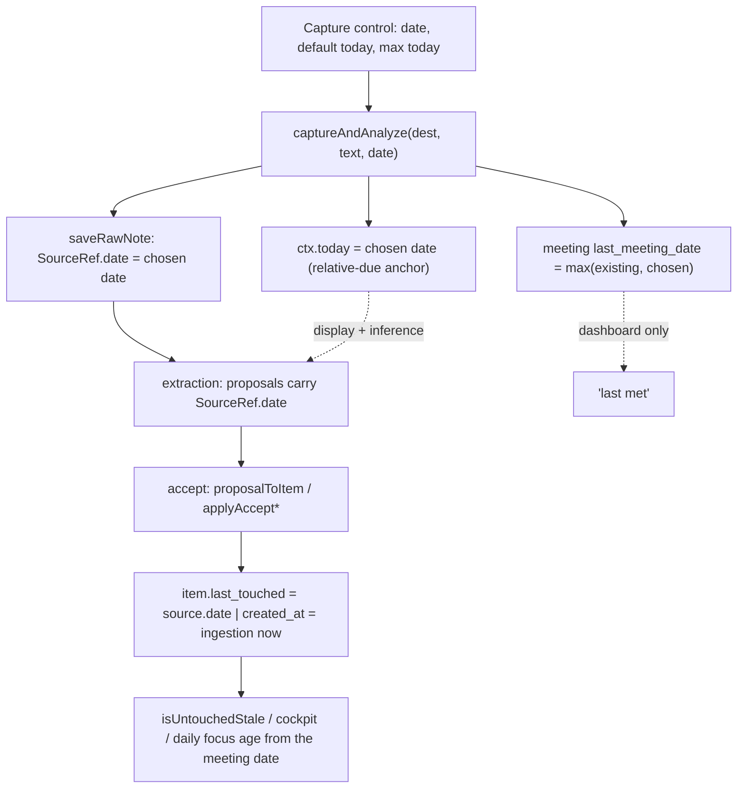

# feat: Manual meeting-date backfill (event-time follow-through)

## Summary

Add a manual meeting-date control to the note-capture flow, defaulting to today, and anchor the follow-through engine's staleness clock to that date instead of the paste-in time. The chosen date flows through the pure write path so commitments from a backfilled meeting age from when they were really made. Reuses existing fields, so no schema bump and no migration.

---

## Problem Frame

The app stamps every captured note and extracted commitment with the ingestion time. When notes are entered late, the staleness clock, cockpit ranking, and daily-focus all mis-age the work, because they read `last_touched`, which is set to "now" at every write site. The fix is to let the user state when the meeting happened and seed `last_touched` from it. Setting only the display date (`source.date`) changes nothing behavioral, so the load-bearing requirement is the clock seed (R6). (See origin: `docs/brainstorms/2026-06-20-meeting-date-backfill-requirements.md`.)

---

## Requirements

Carried from the origin requirements doc (R-IDs preserved 1:1).

**Capturing the meeting date**

- R1. The capture screen presents a meeting-date control defaulting to today, changeable before save, built without a `<form>` element.
- R2. A note left at the default date behaves exactly as today, with no added steps for same-day capture.
- R3. The control rejects any date after today.
- R4. The meeting date is a property of the captured note; backfilling several past meetings means entering each note with its own date.

**Anchoring the follow-through engine**

- R5. The confirmed date becomes the provenance date of the note and every item extracted from it, replacing the paste-in timestamp.
- R6. The confirmed date seeds the staleness clock (`last_touched`) of every commitment from the note, so commitments age from the meeting date. Load-bearing.
- R7. A backfilled commitment already past its window surfaces as slipping immediately on acceptance, with no grace period.
- R8. Relative due dates in the notes ("by Friday") resolve against the confirmed meeting date.

**Display and integrity**

- R9. The newest note's meeting date updates the meeting's "last met" date on the dashboard; backfilling an older note never moves "last met" earlier than a more recent note set it.
- R10. A date in a year other than the current year displays with its year.

---

## Key Technical Decisions

- KTD1. The event date travels on `SourceRef.date`; `proposalToItem` seeds `last_touched` from it while `created_at` keeps the ingestion instant. The date already rides through extraction on the source ref, so reading it for the clock is the minimal seam, and a separate `created_at` preserves a true entry timestamp. Escalation is open-count-driven, so a backdated `last_touched` does not distort it.
- KTD2. Plumb the date through the pure top-level functions, not the in-`App` closures. `saveRawNote` and `captureAndAnalyze` are `useCallback` closures and not unit-testable; threading the date into `proposalToItem`, `applyAccept*`, and `addMeetingNote`/`addProjectUpdate` keeps the behavior covered by `dev/tests/`, with only a thin UI smoke for the control.
- KTD3. Apply to both meeting and project captures. Project items age off the same `last_touched`, and the date threads through the shared functions at near-zero extra cost. The "last met" revival (R9) is meeting-only, since projects have no equivalent field.
- KTD4. Block future dates with the input `max` attribute and validate on save: a date after today is rejected with an inline error (reusing the capture surface's existing error state), not silently changed. A future `last_touched` makes `isUntouchedStale` never fire; a visible rejection beats a silent clamp and is simpler than the "held until" state considered in ideation.
- KTD5. No `schema_version` bump. The date reuses fields that already exist (`note.timestamp`, `source.date`, `last_touched`, `last_meeting_date`); only the written value changes. Existing data, Import, and Export stay valid.
- KTD6. Convert a date-only input value to ISO anchored at local noon. `new Date("YYYY-MM-DD")` parses as UTC midnight, which renders as the previous calendar day in negative-UTC-offset zones; a local-noon anchor keeps the displayed date equal to the picked date.

---

## High-Level Technical Design

The chosen date fans out from the capture surface, but only the `last_touched` path changes engine behavior.

The seed at `proposalToItem` is a no-op in production until the capture flow supplies a real date, because `source.date` equals `nowISO()` today. This lets U1 land and be tested before U2 activates it.

---

## Implementation Units

### U1. Seed staleness and provenance from the event date (pure core)

- Goal: accepted commitments age from their source (event) date while keeping the ingestion timestamp; saved notes can carry an optional event date.
- Requirements: R5, R6, R7.
- Dependencies: none.
- Files: `meeting-assistant.tsx` (`proposalToItem` ~1383, `applyAcceptToMeetingData` ~1434, `applyAcceptToProjectData` ~1441, `addMeetingNote` ~1026, `addProjectUpdate` ~1030); `dev/tests/verify-merge.test.ts`; `dev/tests/staleness.test.ts`.
- Approach: `proposalToItem` sets `last_touched` from the item's source date (`p.source?.date ?? now`) and leaves `created_at: now`. Confirm `applyAcceptToMeetingData`/`applyAcceptToProjectData` carry that through. `addMeetingNote`/`addProjectUpdate` take an optional timestamp argument (default `nowISO()`) for `note.timestamp`. Because `source.date` is `nowISO()` today, this is behaviorally inert in production until U2 supplies a real date.
- Execution note: implement the `proposalToItem` seed test-first — a failing test asserting `last_touched` equals the source date is the keystone behavior.
- Patterns to follow: existing `proposalToItem`/`applyAccept*` signatures; the `verify-merge.test.ts` factories (`SRC` const, `prop()`, `openItem()`) and the `staleness.test.ts` fixed-`NOW` + `daysAgo()` convention.
- Test scenarios:
  - Covers AE2. A proposal whose `source.date` is 10 days ago yields an item with `last_touched` 10 days ago and `created_at` equal to the passed ingestion `now`.
  - Fallback: a proposal with no source date yields `last_touched = now` (back-compat, the current behavior).
  - `applyAcceptToMeetingData` and `applyAcceptToProjectData` propagate the seeded `last_touched` into the stored items.
  - Covers AE2. An item with `last_touched` 10 days ago and confirmed `interval_days` 7 reports `isUntouchedStale` true (immediately slipping).
  - `addMeetingNote`/`addProjectUpdate` set `note.timestamp` from the optional argument, and default to `nowISO()` when it is omitted.
- Verification: new tests green; the existing `verify-merge` and `staleness` suites still pass, confirming the production no-op.

### U2. Thread the chosen date through the capture orchestrator

- Goal: carry the user's date from capture into the note timestamp, provenance, extraction anchor, and "last met".
- Requirements: R5, R8, R9.
- Dependencies: U1.
- Files: `meeting-assistant.tsx` (`saveRawNote` ~1923, `captureAndAnalyze` ~1946, `updateMeeting` ~2222, a new `fromDateInput` helper near `toDateInput` ~2894, and a `latestMeetingDate` max-wins helper); `dev/tests/verify-merge.test.ts` (or a small new test for the helpers).
- Approach: `captureAndAnalyze` gains a date parameter; it converts the input value via `fromDateInput` (local-noon anchor, KTD6), passes it to `saveRawNote` (which stamps `sourceRef.date` in place of `nowISO()` at ~1933/1937 and the note timestamp via U1's optional argument), and sets `ctx.today` to the chosen `YYYY-MM-DD` (R8). For meeting destinations it updates "last met" through the existing `updateMeeting(recordId, { last_meeting_date: latestMeetingDate(existing, chosen) })` after the note is saved, reading `existing` from the meeting record already loaded in `captureAndAnalyze` (~1954); `next_meeting_date` is untouched (R9). A date after today is rejected on save with an inline error rather than silently changed (KTD4); `fromDateInput` stays a pure local-noon converter. These functions are in-`App` closures, so their wiring is exercised through the smoke test plus U1's pure assertions; extract `fromDateInput` and `latestMeetingDate` as top-level functions so they are unit-testable.
- Patterns to follow: the setup-modal input-to-ISO conversion (`meeting-assistant.tsx:3512`), reworked through the shared `fromDateInput`.
- Test scenarios:
  - Covers AE5. `latestMeetingDate(existing, chosen)`: a chosen date older than the existing one returns the existing (no regression); a newer chosen date returns the chosen; null existing returns the chosen.
  - `fromDateInput("2026-06-20")` produces an ISO whose local calendar date is 2026-06-20, round-tripping through `toDateInput`/`fmtDate` with no off-by-one (KTD6).
  - The chosen date converts to the extraction anchor: the local `YYYY-MM-DD` derived for `ctx.today` equals the picked date, so the R8 wiring is unit-tested even though the AI's use of it is verified only in the artifact.
  - A future date is rejected on save: validation returns an error and the note is not dated forward (KTD4).
- Verification: backfilling a note end-to-end (smoke) yields items whose `last_touched` matches the chosen date, and the meeting's "last met" reflects the newest note's date.

### U3. Capture-screen date control (UI)

- Goal: let the user set the meeting date at capture, defaulting to today, with no future dates.
- Requirements: R1, R2, R3, R4.
- Dependencies: U2.
- Files: `meeting-assistant.tsx` (`CaptureSurface` ~2802, `ScopedCapture` ~3913; reuse `Field` ~3443, `inputStyle` ~3451, `toDateInput` ~2894); `dev/tests/smoke.test.ts`.
- Approach: add `meetingDate` state seeded to `toDateInput(nowISO())` and an `<input type="date" max={today}>`. On `CaptureSurface`, wrap it in a `Field` labelled "Meeting date" with a short hint ("When did this happen? Defaults to today.") so the control reads as the meeting's date, not the save date, and as editable, mirroring the setup modal's "Next meeting date" row (`meeting-assistant.tsx:3523`). On `ScopedCapture`, place a compact inline date input in the existing action row (not a block `Field`) so the card's compact layout is preserved; this second surface is the approved both-surfaces scope decision. Pass `meetingDate` through `onSave` into `captureAndAnalyze`. The default-today value keeps same-day capture unchanged (R2); the `max` attribute plus on-save rejection block future dates (R3); per-capture state means each note carries its own date (R4).
- Patterns to follow: `Field` + `inputStyle` + `<input type="date">` from `MeetingSetupModal` (`meeting-assistant.tsx:3520-3523`); `toDateInput` for the default value.
- Test scenarios:
  - Covers R1, R3. Smoke: `CaptureSurface` renders a labelled date input defaulting to today with `max` set to today.
  - Smoke: `ScopedCapture` renders its inline date input defaulting to today without disrupting the action row.
- Verification: the control renders on both capture surfaces, defaults to today, and rejects future selection with a visible error; R2 and R4 hold by construction (default value and per-capture state) and are confirmed by U1/U2 data tests rather than UI assertions.

### U4. Year-aware date display

- Goal: show the year when a date is not in the current year, so backfilled prior-year dates are unambiguous.
- Requirements: R10.
- Dependencies: none.
- Files: `meeting-assistant.tsx` (`fmtDate` ~2887); `dev/tests/format.test.ts` (new).
- Approach: `fmtDate` appends the year when the date's year differs from the current year; current-year dates render unchanged (month and day). To keep the test hermetic, give `fmtDate` an optional second argument for the reference date (default `new Date()`), mirroring the `now = new Date()` convention used across the staleness functions. The ~20 existing call sites consume `fmtDate(iso)` unchanged.
- Patterns to follow: the staleness functions' optional `now` parameter (e.g. `isStale(it, now = new Date())`).
- Test scenarios:
  - Covers AE6. `fmtDate` of a current-year date returns month and day only; `fmtDate` of a prior-year date includes the year; null or invalid input returns an empty string.
- Verification: the new `fmtDate` test is green and a spot check of representative display sites renders correctly.

---

## Acceptance Examples

Carried from the origin doc; each maps to test coverage above.

- AE1. Same-day default unchanged. Covered by U3's default-today value and U1's no-source-date fallback.
- AE2. Backfilled overdue commitment surfaces immediately. Covered by U1's staleness scenarios.
- AE3. Future date refused. Covered by U3's `max` attribute (and U2's clamp backstop).
- AE4. Relative due date resolves to the meeting's week. Set by U2's `ctx.today` override; verified live in the artifact, since keyless AI extraction does not run locally.
- AE5. Last-met never regresses. Covered by U2's `latestMeetingDate` scenarios.
- AE6. Prior-year date is unambiguous. Covered by U4's `fmtDate` scenarios.

---

## Scope Boundaries

**Deferred for later** (origin)

- AI inference of the meeting date from note text, with the post-accept rewrite, explicit-date parser, and inferred-vs-entered provenance flag it would require.
- Cadence options (Daily and Outlook-style Custom weekday recurrence) — a separate feature with its own brainstorm.

**Deferred to follow-up work**

- Adopt the local-noon `fromDateInput` helper at the existing setup-modal and due-date inputs, which share the same latent UTC-midnight off-by-one. These inputs do not affect backfill correctness and the issue predates this feature, so consistent correction is deferred rather than dropped.

**Not in scope** (origin)

- Changes to the staleness math, escalation, or cockpit ranking themselves.
- A grace window or any suppression of slipping-on-entry.
- A "held until" state for future-dated items.
- Dating the manual to-do add path (`meeting-assistant.tsx` ~2184) or editing an existing note's date after capture.

---

## Risks & Dependencies

- Timezone off-by-one. The existing input-to-ISO pattern is UTC-midnight, which renders the prior day in Bryan's negative-UTC-offset zone. Mitigated by KTD6 and the shared `fromDateInput` helper; the existing modal inputs keep the latent issue (deferred follow-up).
- `fmtDate` ripple. The year change touches ~20 display sites, all benign — they only gain a year for off-year dates. Low risk, noted for review.
- AI relative-due anchoring (R8 / AE4) cannot be verified locally because the keyless call does not run without the claude.ai runtime. Verify in the artifact at paste-in.
- The feature depends on the follow-through engine reading `last_touched`, which is unchanged by this work.

---

## System-Wide Impact

Backfilled commitments that are already overdue will appear as slipping in the cockpit and daily focus on acceptance, which is the intended behavior (R7). No other surface changes behavior. The `fmtDate` year applies uniformly across every date display in the app.

---

## Open Questions

- Placement of the date control within `CaptureSurface` (next to the textarea versus in the send-to row) is the implementer's discretion; both satisfy R1.

---

## Sources / Research

- Origin requirements: `docs/brainstorms/2026-06-20-meeting-date-backfill-requirements.md`.
- Code anchors in `meeting-assistant.tsx`: `CaptureSurface` 2802-2879; `ScopedCapture` 3913-3926; `saveRawNote` 1923-1941 (`sourceRef.date` at 1933/1937); `captureAndAnalyze` 1946-1970 (`ctx.today` at 1950, prompt anchor at 1159); `proposalToItem` 1383-1394 (`created_at`/`last_touched` at 1390); `applyAcceptToMeetingData` 1434, `applyAcceptToProjectData` 1441; `addMeetingNote` 1026, `addProjectUpdate` 1030; `toLedgerCommitment` `source.date` at 627; `isUntouchedStale` 1524-1527; `fmtDate` 2887-2893; `toDateInput` 2894-2899; setup-modal date input 3507/3512/3523; `inputStyle` 3451; `Field` 3443-3450; `SourceRef` 340-345; `Destination` 1010-1014.
- Test harness: `dev/vite.config.ts` (Vitest, jsdom, `dev/tests/**/*.test.ts`); tests import named exports from `"../../meeting-assistant"`; relevant files `dev/tests/verify-merge.test.ts`, `dev/tests/staleness.test.ts`, `dev/tests/smoke.test.ts`; assertion style uses a fixed `NOW` plus `daysAgo()` helpers.
