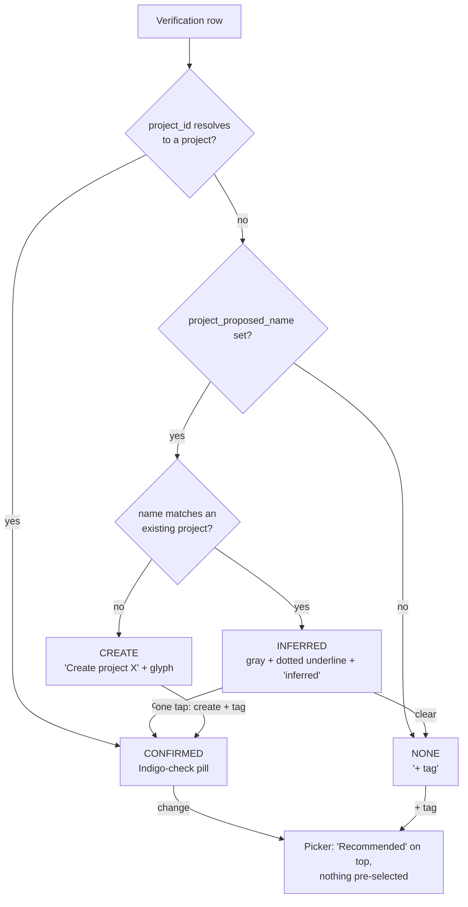

# feat: Inferred project-tag confirmation (ratify by default)

## Summary

Change how an AI-proposed project tag behaves during note verification so nothing applies without an explicit tap. Delete the accept-time auto-apply that silently tags existing-project matches, retire the amber "Tag: X?" pill in favor of the app's existing inferred-field treatment with a one-tap confirm, render a genuinely new project name as an explicit "Create project X" action, and surface the recommendation at the top of the retag picker without pre-selecting it. Reuses existing fields and the shipped inferred/confirmed pattern, so there is no schema bump, no new stored field, and no change to extraction logic. (See origin: `docs/brainstorms/2026-07-03-tag-confirmation-model-requirements.md`.)

---

## Problem Frame

During verification a proposed tag shows as one amber "Tag: X?" pill that hides two opposite behaviors on Accept. An existing-project match is auto-applied without confirmation (violating surface-specs R20, "Accept never auto-confirms inference"). A non-matching name is dropped and, because the committed item has no field to hold a proposed name, permanently destroyed. The user cannot tell which case they are in, and the "?" reads as "confirm me," not "I will apply myself if you look away." The amber pill also breaks the visual system twice: it spends the scarce do-next color and uses a pill shape for something the design language says must render as quiet inferred ink. The symptom first reported, a recommendation buried in the picker instead of surfaced at the top, is the same root: the confirm path is hostile exactly where the auto-apply path was too permissive. (See origin.)

---

## Requirements

Carried from the origin requirements doc (R-IDs preserved 1:1).

**No silent application**

- R1. No AI-proposed project tag is applied to an item unless the user confirms it during verification; a proposed tag left untouched results in an untagged item.
- R2. This holds even when the proposed name exactly matches an existing project: it still renders unconfirmed and still requires a tap. No auto-apply path.
- R3. The accept/commit step applies only the tags the user confirmed; it performs no name-matching or tag application of its own.

**The inferred-tag treatment**

- R4. An unconfirmed proposed tag renders in the app's inferred visual language (secondary-gray text, dotted underline, "inferred" label). No amber, no pill, no "?".
- R5. Confirming a proposed tag is a single tap that flips it in place from inferred to confirmed; a confirmed tag renders as a solid Indigo-check project pill.
- R6. The user can decline or clear a proposed tag, leaving the item untagged.
- R7. Each item's tag is confirmed independently; confirming one never confirms another.

**New-project proposals**

- R8. A proposed name that matches no existing project renders as a distinct "Create project X" action, visually different from confirming an existing-project tag.
- R9. The create affordance reads explicitly as a create action (a create glyph and the word "Create"), so a single tap is an informed choice.
- R10. A single tap on the create action creates the project and tags the item; left untouched, the item is saved untagged and the proposed name is not retained.

**The recommendation in the picker**

- R11. When the user opens the project picker from a verification row that has a recommendation, that recommendation surfaces at the top under a "Recommended" label.
- R12. Surfacing the recommendation does not pre-select it: no option is highlighted on open, and a stray Enter before the user chooses selects nothing.

---

## Key Technical Decisions

- KTD1. Restore R20 by deleting the accept-time auto-apply, not by resolving matches earlier. The `onAccept` branch that matches `project_proposed_name` to an existing project and injects `project_id` (meeting-assistant.tsx ~3258-3264) is removed. An unconfirmed proposal then keeps `project_id = null`, and `proposalToItem` writes `project_id` only, so an unconfirmed tag is structurally uncommittable. Resolving an existing match to `project_id` at extraction was rejected: the render keys confirmed-vs-inferred on `project_id` presence, so that would make the match render as already-confirmed, auto-confirming the inference (a new R20 violation).
- KTD2. Carry confirmed-vs-inferred on the existing field invariant, with no new field. `project_id` set means confirmed; `project_proposed_name` set with `project_id` null means inferred/unconfirmed. The two are already mutually exclusive because the confirm and picker paths null one when they set the other. This parallels `due_confirmed` / `owner_confirmed` without adding a `project_confirmed` field, keeping the origin's no-schema-bump constraint (origin KD5).
- KTD3. Decide existing-match-vs-new-name at render time via a lookup of the proposed name against current projects. The confirm handler already does this find (~3128). Render-time is simpler than caching the distinction at extraction and strictly more correct: a name that becomes a real project mid-verification (created for another item) reclassifies from "create" to "inferred" on the next render.
- KTD4. Extract the tag state as a pure, exported `classifyProposedTag(row, projects)` returning `confirmed | inferred | create | none`, so the render is thin glue and the logic is unit-testable in the dev harness. Give the commit rule a pure seam as well: extract `onAccept`'s row transform into `resolveAcceptedTags(rows, projects)` (post-fix: identity on `project_id`, no name-matching), so the unit test targets the exact site the auto-apply is deleted from and any re-introduction of matching there fails the test. Testing only the downstream `proposalToItem` path would not guard the deletion, because that path never performed the auto-apply.
- KTD5. One-tap semantics differ by state. Tapping an inferred existing-match confirms in place (resolve name to the existing id, null the proposed name); tapping "Create project X" creates and tags (reuse the existing create branch); a secondary "change" affordance opens the picker (where the recommendation lives) and a "clear" affordance untags. The due-date field is the visual template, but tags need no editor step because the value is already known.
- KTD6. Surface the picker recommendation via an optional prop threaded only from the verification retag call site. A "Recommended" group renders first, injecting an existing-project destination when the name matches or a create-new destination when it does not, with `active = -1` and the stray-Enter no-op unchanged so nothing is pre-highlighted. The picker's other call site (capture destination) passes nothing and is unaffected.
- KTD7. Adopt the app's existing inferred-field language (Inferred Ink plus one-tap confirm) rather than refactoring owner/due into a shared primitive. The reusability is a documented principle; the working owner and due code is untouched (origin KD7).

---

## High-Level Technical Design

The tag has four render states, decided from `project_id`, `project_proposed_name`, and the current project list. Only `project_id` is written at commit, so every unconfirmed state carries no tag into storage.

The commit guarantee is the load-bearing part: `proposalToItem` writes `project_id` and the committed `Item` has no field for a proposed name, so the INFERRED, CREATE, and NONE states (all `project_id = null`) commit untagged. Deleting the `onAccept` auto-apply is what makes that guarantee hold end to end (R1-R3). `classifyProposedTag` is the single source for which state a row is in; the render and the one-tap handlers both read it.

---

## Implementation Units

### U1. Remove accept-time auto-apply so no tag commits without confirmation

- **Goal:** An unconfirmed proposed tag (existing match or new name) is never written at commit; only a user-confirmed `project_id` reaches the stored item. Restores R20.
- **Requirements:** R1, R2, R3
- **Dependencies:** none
- **Files:** `meeting-assistant.tsx` (`onAccept` ~3254-3270), `dev/tests/verify-merge.test.ts`
- **Approach:** Extract the row transform currently inside `onAccept` (the `live.map` that finds a name match and injects `project_id`, ~3258-3264) into a pure exported helper `resolveAcceptedTags(rows, projects)`, and have `onAccept` call it so the component and the test share one path. The post-fix body is identity on `project_id` with no name-matching, so an unconfirmed row (`project_id` null) stays untagged. This puts the deleted logic under test at the exact site it lived: re-introducing any name-matching in `resolveAcceptedTags` fails the unit test. `proposalToItem` already writes `project_id` only and needs no change. (Testing the downstream `proposalToItem` / `applyAcceptToMeetingData` path alone would not guard the deletion, since those functions never performed the auto-apply and pass green today.)
- **Execution note:** Start test-first; this is the load-bearing R20 restoration.
- **Patterns to follow:** the pure-export + Vitest convention and the `prop(...)` fixture builder in `dev/tests/verify-merge.test.ts`.
- **Test scenarios:**
  - Covers AE1. `resolveAcceptedTags` leaves an unconfirmed row (`project_id` null, `project_proposed_name` matching an existing project) at `project_id` null — the transform performs no name-matching. This is the deletion's regression guard.
  - `resolveAcceptedTags` passes a confirmed row (`project_id` set) through unchanged.
  - A proposal with a non-matching (new) `project_proposed_name` and null `project_id`, run through `resolveAcceptedTags` then `proposalToItem`, commits untagged; the committed item carries no proposed-name field.
  - Edge: a batch mixing confirmed and unconfirmed rows keeps only the confirmed `project_id`s after `resolveAcceptedTags`.
- **Verification:** existing-match proposals left untouched save untagged; nothing auto-tags at accept; dev suite green.

### U2. Inferred-ink treatment and one-tap confirm for existing-match tags

- **Goal:** Replace the amber "Tag: X?" pill with the app's inferred-field treatment for an existing-match proposal; one tap confirms in place; a clear affordance untags.
- **Requirements:** R4, R5, R6, R7
- **Dependencies:** U1
- **Files:** `meeting-assistant.tsx` (`VerificationRow` render ~3106-3138, pill ~3111-3119, confirm/remove row ~3126-3132, `pickProject` ~3100-3104), `dev/tests/verify-merge.test.ts` (or a new `dev/tests/tag-classify.test.ts`)
- **Approach:** Extract a pure exported `classifyProposedTag(row, projects)` returning `confirmed | inferred | create | none`. Render: confirmed keeps `ProjectTagPill`; inferred renders secondary-gray text with a dotted underline and an "inferred" label, mirroring the due-date block (~3167-3170), and a tap confirms it (resolve the proposed name to the existing project id, null the proposed name); none keeps "+ tag". Remove the standalone amber pill and the separate "Confirm tag / Remove" row, folding confirm into the tap while keeping a "clear" affordance (nulls the proposed name) and a "change" affordance (opens the picker). The create state is handled in U3. Note the proposed-tag control renders for both to-do and decision rows: the pill block sits outside the owner/decision branch and `proposalToDecision` also writes `project_id`, so "row" throughout U2 and U3 includes decision rows, which get the same inferred/confirm treatment.
- **Patterns to follow:** the inferred/confirmed due-date block (~3153-3176); the `OwnerPill` flip (~3088-3093); confirmed = Indigo check, no green.
- **Test scenarios:**
  - `classifyProposedTag` returns `confirmed` when `project_id` resolves, `inferred` when the proposed name matches an existing project with `project_id` null, `none` when neither is set.
  - Covers R5. Confirming an inferred row sets `project_id` to the matched project and nulls the proposed name (state becomes confirmed).
  - Covers R6. Clearing an inferred row nulls the proposed name (state becomes none).
  - R7. Given two rows with proposed tags, classifying or confirming one does not change the other's state.
  - Render smoke (where the harness seam allows): an inferred existing-match row shows the "inferred" label and no amber background.
- **Verification:** no amber "?" pill remains for a proposed tag; an existing-match tag reads as inferred and confirms in a single tap.

### U3. New-project proposals as an explicit "Create project X" action

- **Goal:** A proposed name matching no project renders as a distinct create action; one tap creates the project and tags the item.
- **Requirements:** R8, R9, R10
- **Dependencies:** U2
- **Files:** `meeting-assistant.tsx` (`VerificationRow` render; the confirm handler's create branch ~3128; `onResolveProject` / `createProject` flow), `dev/tests/verify-merge.test.ts` (or the U2 test file)
- **Approach:** When `classifyProposedTag` returns `create`, render a "Create project 'X'" control with a `Plus` glyph and indigo text, visually distinct from the inferred existing-match tag, mirroring the picker's create row (~2799). One tap creates the project through the existing create path and sets `project_id`. Untouched leaves the item untagged (U1), and the proposed name is not retained. U3 extends the same render switch U2 introduces (~3111-3138) and reuses the create branch at ~3128, so author it immediately after U2 to keep the shared region conflict-free.
- **Patterns to follow:** the picker create row's `Plus` glyph + indigo (~2799); the existing confirm-handler create branch (~3128); the destination picker's "Create new project" affordance.
- **Test scenarios:**
  - `classifyProposedTag` returns `create` when the proposed name matches no existing project.
  - Covers AE3. Render smoke (where reachable): a new-name row shows "Create" plus the name and the create glyph, not the inferred existing-match styling.
  - Covers AE4. Tapping create yields a new project and transitions the row to confirmed with that `project_id`; not tapping leaves the item untagged with no new project created.
  - Edge: a name that matches a project created mid-verification reclassifies from `create` to `inferred` on the next render (render-time lookup, KTD3).
- **Verification:** new-name proposals are visibly a create action, never a silent link; a single tap creates and tags.

### U4. "Recommended" at the top of the retag picker

- **Goal:** When the picker opens from a verification row that has a recommendation, surface it at the top under "Recommended" without pre-selecting it.
- **Requirements:** R11, R12
- **Dependencies:** U2
- **Files:** `meeting-assistant.tsx` (`DestinationPicker` ~2666-2811, the retag invocation ~3134-3138), `dev/tests/routing.test.ts` (or a new picker test)
- **Approach:** Add an optional `recommended` prop (the row's proposed name plus the matched project id when it matches) to `DestinationPicker`. Add "Recommended" as the first entry in the group order and inject the recommended option ahead of Recent: an existing-project destination when the name matches, otherwise a create-new destination. Show the Recommended group only when the query is empty, mirroring the Recent group's `if (!q)` gate (~2716), so a typed search never keeps the list non-empty and defeats the "No matches" empty state. The create-new recommendation must bypass the picker's existing non-empty-`typed` requirement for create rows (~2727), since the name comes from the prop rather than the search box. Keep `active = -1` and the stray-Enter no-op unchanged. Thread the prop only from the verification retag call site; the capture destination picker passes nothing. Put the recommendation injection in a pure helper so ordering and the no-pre-select behavior are unit-testable. The recommended project may also appear in its normal Projects group below, matching the Recent group's existing double-listing precedent — no dedup needed.
- **Patterns to follow:** the existing group build (`options` useMemo ~2711-2723, the `if (!q)` Recent gate ~2716, `groups` ~2757); `active = -1` (~2679) and the stray-Enter guard (~2752).
- **Test scenarios:**
  - Covers R11. With a recommendation present and an empty query, the first rendered group is "Recommended" containing the proposed project (or the create-new option).
  - Covers R12. `active` stays -1 with a recommendation present; a stray Enter before selection commits nothing.
  - Covers R12. With a recommendation present and a typed query that matches no project, the Recommended entry is hidden and the picker shows its "No matches" empty state.
  - Without a recommendation, the picker order is unchanged (Recent / Meetings / Projects).
  - A recommendation matching an existing project injects a project destination; a non-matching name injects a create-new destination.
- **Verification:** opening the picker to retag shows the recommendation first with nothing highlighted; Enter before choosing does nothing.

---

## Scope Boundaries

### Deferred to Follow-Up Work

- Actively inviting new project names from the model (updating the extraction prompt so a new-name proposal is first-class rather than off-spec output). This plan builds the create path defensively; a follow-up can flip the prompt once project-sprawl and extraction quality are validated in the artifact.
- A bulk "Confirm all suggested tags" action (origin deferred; one-tap per item is cheap and multi-project notes make per-item the common case).
- Post-accept recovery of a skipped proposed tag (origin deferred; needs an additive item field plus a schema decision).

### Not in scope

- Refactoring the owner and due-date fields into a shared inferred-confirmation primitive (KTD7 / origin KD7): adopt the pattern, do not rework the working code.
- Changes to staleness, cockpit ranking, escalation, or follow-through logic: this plan changes only how a tag is proposed and confirmed, not what a tag does downstream.

---

## Open Questions

Deferred to implementation.

- The exact inline layout of the inferred tag's tap-to-confirm, "change" (open picker), and "clear" affordances within the control row, calibrated against the live surface and design tokens at build. The due-date pattern is the template.
- Whether "change" and "clear" are both always visible or progressively disclosed, a microcopy and affordance detail for build.
- Whether the render smoke tests can drive `VerificationSurface` without an analysis run, or whether `VerificationRow` is rendered in isolation with a seeded provider; decide at build from the harness seam. The pure `classifyProposedTag` and picker-injection helpers are testable regardless.

---

## Sources & Research

- Origin requirements: `docs/brainstorms/2026-07-03-tag-confirmation-model-requirements.md`.
- Code anchors (verified current in `meeting-assistant.tsx`): `onAccept` auto-apply ~3258-3264; `proposalToItem` writes `project_id` only ~1385-1398; `VerificationRow` proposed-tag pill ~3113-3116 and confirm/remove row ~3126-3132; the inferred/confirmed due-date template ~3153-3176; `DestinationPicker` `active = -1` ~2679, stray-Enter no-op ~2752, group order ~2757, create-row glyph ~2799; `buildProposalsFromParsed` sets `project_proposed_name` to the canonical-or-raw name ~1249-1257; extraction prompt restricts `project` to an existing name or null ~1140-1141.
- Design rules honored or restored: surface-specs R20 (Accept never auto-confirms inference); the Inferred Ink rule (not a pill; secondary-gray plus dotted underline plus an "inferred" label); the One Voice and No-Alarm rules (amber is the single scarce do-next signal, not a tag state); confirmed is an Indigo check, never green.
- Dev harness: pure-logic suites in `dev/tests/*.test.ts`; jsdom click-driven render tests in `dev/tests/smoke.test.ts`.
- No external research ran: the approach is settled and the pattern to copy (the inferred due-date treatment) already ships in this file.
